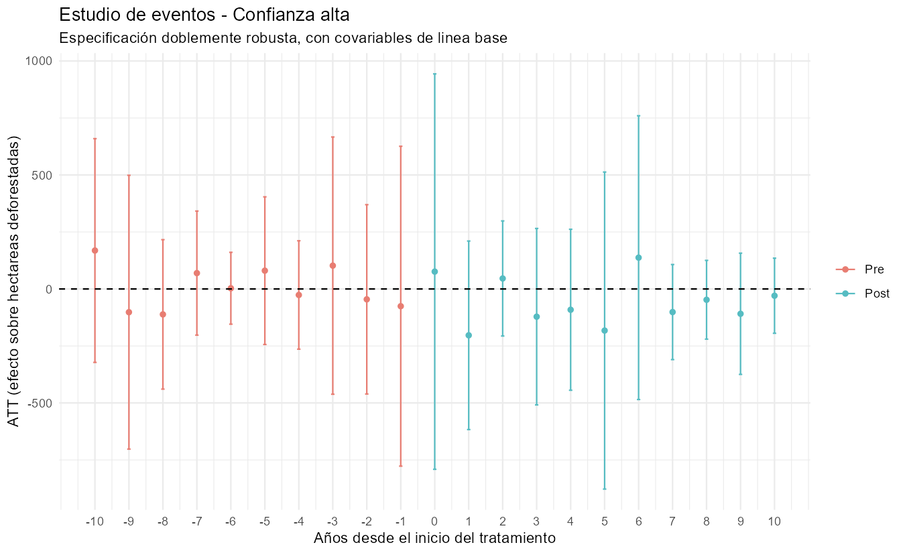
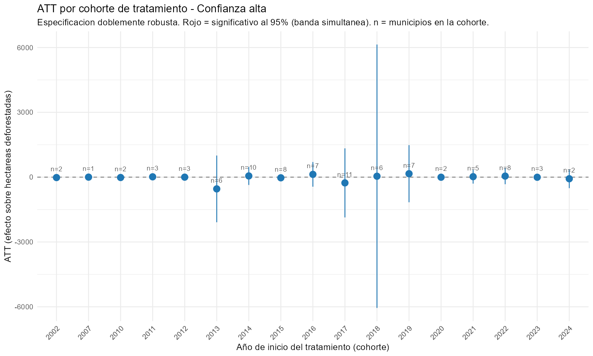

# Evaluación del impacto causal de los proyectos de bonos de carbono sobre la deforestación en Colombia

**Evidencia municipal 2001–2024 para el fortalecimiento de la política climática**

José David Cuervo Urrego · Harold Stiven Acuña Alaguna · Asesor: Jorge Luis Montero Mestre
Maestría en Economía Aplicada · Entidad destinataria: Ministerio de Ambiente y Desarrollo Sostenible (MADS)

---

## Franja superior — El signo del efecto depende del estimador

- Mismo panel, mismo parámetro: TWFE positivo, Callaway–Sant'Anna negativo. **Cambio de signo, no de magnitud.**
- Goodman-Bacon: **97,2 %** del peso proviene de comparaciones limpias contra nunca tratados.
- El origen no son los pesos negativos, sino **el periodo base de comparación** ($g-1$ frente a todo el periodo previo).

**Gráfico:** barras divergentes del ATT con IC 95 %.

| Estimador | ATT (ha) | EE | IC 95 % |
|---|---:|---:|---:|
| TWFE | +53,56 | 80,92 | [−105,0 ; 212,1] |
| Callaway–Sant'Anna, sin covariables | −125,46 | 83,40 | [−288,9 ; 38,0] |
| Callaway–Sant'Anna, doblemente robusta | −57,50 | 81,36 | [−217,0 ; 102,0] |
| Callaway–Sant'Anna, muestra ponderada * | −178,14 | 84,76 | [−344,3 ; −12,0] |
| Sun–Abraham * | −122,83 | 59,41 | [−239,3 ; −6,4] |

(*) intervalo que excluye el cero.

---

# Columna 1

## Problema de política — §1 · §3

- El mecanismo de no causación (Ley 1819 de 2016; Decreto 926 de 2017) permite compensar el impuesto al carbono con créditos certificados.
- Ese incentivo aceleró la expansión de proyectos REDD+ sin evaluación causal previa.
- Sobreacreditación documentada: los créditos emitidos equivalen a **10,7 veces** las reducciones verificables en 44 proyectos REDD+ (Swinfield et al., 2026).
- Sin evidencia causal, el MADS no distingue beneficio climático real de acreditación no atribuible.

> ¿En qué medida los proyectos de bonos de carbono reducen la deforestación municipal en Colombia entre 2001 y 2024?

Se evalúan tres condiciones necesarias de integridad ambiental: adicionalidad, persistencia y desplazamiento espacial.

## Datos — §4

| | |
|---:|---|
| **1.122** | municipios |
| **26.928** | observaciones municipio–año |
| **88–99** | municipios tratados |
| **17–19** | cohortes de adopción |

**Resultado**

- Pérdida de cobertura arbórea, Global Forest Change a 30 m (Hansen et al., 2013), por estadística zonal.
- Distribución muy asimétrica: mediana de 22 ha frente a máximos sobre 30.000 ha → se añade la **tasa** relativa al bosque base.

**Tratamiento**

| Registro | Proy. | Asignación |
|---|---:|---|
| Verra (API Platts/S&P) | 101 | Punto en polígono |
| Gold Standard (API) | 28 | Punto en polígono |
| RENARE (MADS) | 281 | Coincidencia textual |
| Cercarbono (Excel) | 234 | Coincidencia textual |
| OffsetsDB | 270 | Solo descubrimiento |

Se descartan ACR y CDM. Errores sistemáticos de georreferenciación corregidos por evaluación de las cuatro combinaciones de signo e intercambio.

### Recuadro · Dos definiciones, no dos validaciones

- **Confianza alta:** Verra + Gold Standard, geometría exacta.
- **Todas las fuentes:** añade RENARE y Cercarbono, asignadas por texto.
- La segunda contiene a la primera: coincidir no es validar.

## Hipótesis y contraste — §1 · §6

| Hipótesis | Veredicto empírico |
|---|---|
| H1. ATT negativo | Signo consistente, sin significancia agregada |
| H2. Sin dinámicas previas | Pretendencias sin divergencia creciente |
| H3. Efecto persistente | Sin reversión, sin precisión para afirmarlo |
| H4. Fuga hacia vecinos | No detectable |
| H5. Efecto heterogéneo | Solo la dimensión regional se sostiene |

---

# Columna 2

## Estrategia empírica — §5

Diferencias en diferencias con adopción escalonada. Parámetro de interés, identificado contra el periodo previo a la adopción:

$$
ATT(g,t) = \mathbb{E}\left[Y_{t}-Y_{g-1} \mid G_{g}=1\right] - \mathbb{E}\left[Y_{t}-Y_{g-1} \mid C=1\right]
$$

donde $G_g$ es la cohorte que adopta en el año $g$ y $C$ el conjunto de municipios aún no tratados. La agregación dinámica produce el estudio de eventos; la simple, el ATT global.

Especificación de contraste metodológico:

$$
Y_{it} = \alpha_i + \delta_t + \beta D_{it} + \varepsilon_{it}
$$

- Emparejamiento completo por puntaje de propensión sobre **doce covariables** de línea base: clima, accesibilidad, conflicto y bosque base.
- Control efectivo de **156,5** municipios frente a 82 con emparejamiento uno a uno; 87 de 88 tratados conservan pareja.
- Robustez: Sun y Abraham (2021), imputación de Borusyak et al. (2024), sensibilidad de Rambachan y Roth (2023).

## Efecto promedio — §6.1

**Tabla 6.1.** ATT sobre la pérdida de bosque. (*) intervalo que excluye el cero al 5 %.

| Especificación | ATT (ha) | EE |
|---|---:|---:|
| Alta · sin covariables | −125,46 | 83,40 |
| Alta · doblemente robusta | −57,50 | 81,36 |
| Alta · muestra ponderada * | −178,14 | 84,76 |
| Todas · sin covariables | −105,86 | 70,63 |
| Todas · doblemente robusta | −54,86 | 72,06 |
| Todas · muestra ponderada * | −149,70 | 70,15 |

- Las seis coinciden en signo negativo.
- Las dos significativas son las que **no** ajustan el desbalance residual en bosque base y distancia al mercado.
- La magnitud varía por un factor cercano a tres entre especificaciones.

## Tendencias paralelas y persistencia — §6.3

- Coeficientes pretratamiento en torno a cero, sin divergencia creciente.
- Postratamiento mayoritariamente negativos, ninguno individualmente significativo.
- Sin reversión sistemática, pero tampoco evidencia de persistencia. **[● prueba conjunta y M̄ mínimo]**

## Heterogeneidad por cohorte — §6.4

Cohortes de uno a doce municipios: los signos opuestos se compensan en el promedio y la dispersión no separa heterogeneidad genuina de ruido muestral.

---

# Columna 3

## Heterogeneidad territorial — §6.5

**Tabla 6.5.** ATT por región. (*) significativo al 5 %.

| Región | ha (alta) | tasa (alta) | tasa (todas) |
|---|---:|---:|---:|
| Andina | +3,06 | −0,024 % | +0,009 % |
| Caribe | +38,66 | +0,097 % | +0,205 % |
| Pacífica | −63,32 | +0,054 % | +0,068 % |
| Orinoquía | −223,14 | −0,060 % | −0,060 % |
| **Amazonía** | **−1.297,41** | **−0,177 % \*** | **−0,163 % \*** |

- Amazonía: único resultado significativo bajo ambas definiciones, y solo en tasa.
- Andina: 45 municipios tratados y el menor error estándar. Es el **nulo mejor estimado** del análisis.

### Recuadro · La magnitud amazónica exige cautela

- El ATT en tasa equivale a ~80 % de la tasa media posterior: reducción implícita del orden de 44 %.
- Difícil de conciliar si los proyectos cubren una fracción minoritaria del bosque municipal.
- La tabla reúne veinte contrastes por subgrupo. **[● p-valores Holm y cobertura mediana]**

## Desplazamiento espacial — §6.6

Vecindad tipo reina; muestra restringida a municipios nunca tratados directamente.

| Enfoque | Coef. (ha) | IC 95 % |
|---|---:|---:|
| Callaway–Sant'Anna | +41,23 | [−93,8 ; 176,2] |
| TWFE con rezago espacial | +279,18 | [74,7 ; 483,7] |

- No es coherente descartar TWFE para el efecto directo y apoyarse en él para afirmar fuga.
- Sin evidencia detectable de desplazamiento; tampoco potencia para descartarlo.

## Limitaciones — §7

- El hallazgo amazónico admite una explicación alternativa: el aumento de deforestación tras la salida de las FARC-EP desde 2016.
- El resultado mide pérdida de cobertura arbórea, no conversión de bosque natural: limita la comparabilidad con el IDEAM.
- Excluir vecinos del control rompe el soporte común: limitación estructural del diseño, no falla de robustez.
- La identificación contra un año base único es sensible a la volatilidad interanual.
- Cobertura de registros incompleta y margen de error en la asignación textual.

## Implicaciones para el MADS — §8

- **Gestión regulatoria.** La ausencia de efecto agregado no respalda una acreditación uniforme: se requieren criterios diferenciados por contexto territorial.
- **Sistema MRV.** RENARE no expone coordenadas ni municipio estructurado; la georreferenciación obligatoria es condición previa para evaluar.
- **Priorización.** El único efecto significativo se concentra en la Amazonía, donde coinciden bosque primario y presión de frontera.

---

## Pie

**Referencias principales.** Callaway y Sant'Anna (2021) · Sun y Abraham (2021) · Goodman-Bacon (2021) · De Chaisemartin y D'Haultfœuille (2020) · Borusyak et al. (2024) · Rambachan y Roth (2023) · Hansen et al. (2013) · Guizar-Coutiño et al. (2022) · Swinfield et al. (2026) · Probst et al. (2024) · Blanton et al. (2024).

**Reproducibilidad.** Panel en Python (pandas, GeoPandas, Google Earth Engine); estimación en R (`did`, `MatchIt`, `spdep`). Los campos marcados **[●]** están en verificación.
